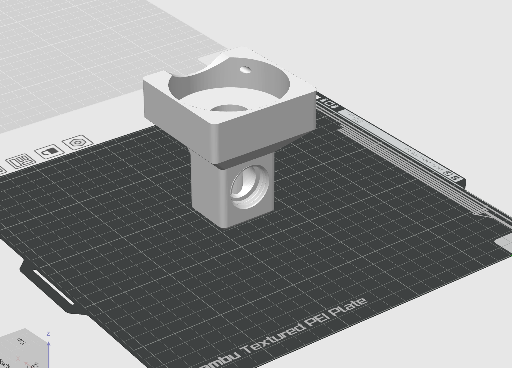
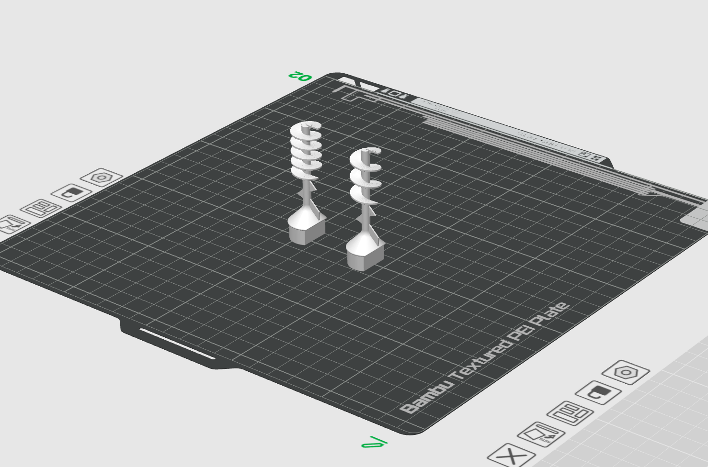
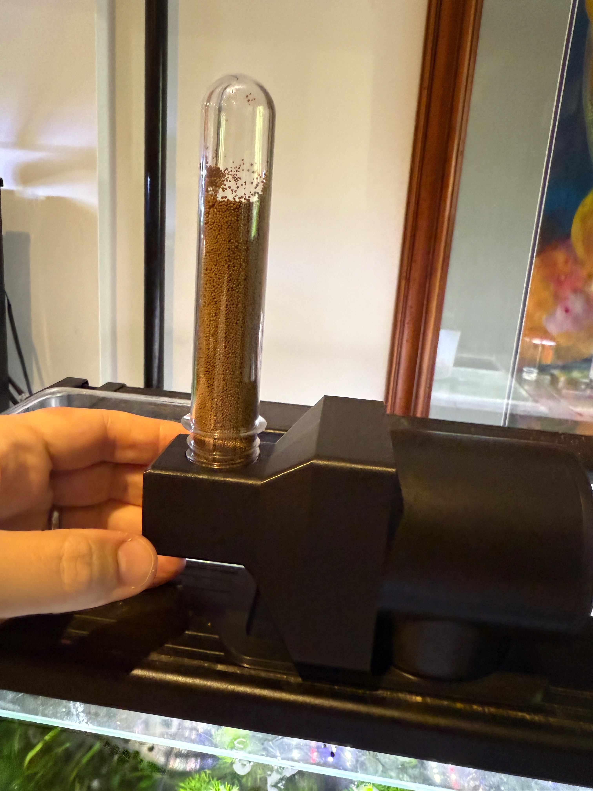

# Auger Feeder Attachment

An auger-style attachment for precise pellet feeding with Aquarium Coop and Nicrew auto feeders.

## Inspiration

This design was inspired by [this Aquarium Coop forum
post](https://forum.aquariumcoop.com/topic/48039-auger-style-feeder-attachment-for-aco-auto-feeder/#comment-436917)
about creating an auger-style feeder attachment.

## Why Use This?

- **Precision feeding** - Perfect for small pellet foods that are difficult to portion with standard drum feeders
- **Compatible** - Works with both Aquarium Coop feeders and Nicrew clones (same shape)
- **Easy to print** - Prints in 2 pieces with no support needed

## Images

*Feeder body with soda bottle thread outlet*

*3-turn and 5-turn auger options*

*Assembled auger feeder attachment*

## Video Demo

*Click the image above to watch the auger feeder in action*

## Files

### STL Files (Ready to Print)
- [`Body.stl`](./Body.stl) - Main body that attaches to the feeder
- [`Auger3Turn.stl`](./Auger3Turn.stl) - 3-turn auger for faster dispensing
- [`Auger5Turn.stl`](./Auger5Turn.stl) - 5-turn auger for more precise/slower dispensing

### CAD Source
- [`AugerFeeder v12.f3d`](./AugerFeeder%20v12.f3d) - Parametric Fusion 360 CAD file for editing and customization

## Design Features

### Parametric Model
The Fusion 360 model is fully parametric, allowing you to customize
the design for your specific needs. The feeder outlet is designed to
accept standard soda bottle threads for easy attachment to custom
feeding tubes or containers.

### Key Parameters to Customize
- **Auger diameter** - Adjust for different pellet sizes
- **Number of turns** - More turns = slower/more precise feeding
- **Body/Auger length** - Extend or shorten to fit your setup

## Printing Instructions

### Body Print Settings
- **Material**: PLA
- **Infill**: 15%
- **Layer Height**: 0.2mm
- **Orientation**: Print sitting on the skinny end
- **Support**: Not required
- **Notes**: These are standard Bambu X1C settings with no modifications needed

### Auger Print Settings
- **Material**: PLA
- **Infill**: 60%
- **Layer Height**: 0.08mm (extra fine for smooth spiral)
- **Support**: Not required
- **Orientation**: vertical, sitting on the D-shaped base
- **Notes**: Higher infill and finer layers create a very smooth spiral (may be overkill but ensures smooth operation)
- **Choose one**: 3-turn (faster dispensing) or 5-turn (more precise dispensing) based on your feeding needs

### Assembly
- Remove all stock hardware from the feeder motor
- Press-fit auger into D-shaped shaft
- Slide body carefully over the auger
- **Optional hardware**: Fasten body to motor with 2x 3/8" #6 pan head screws (stainless steel recommended for durability)
